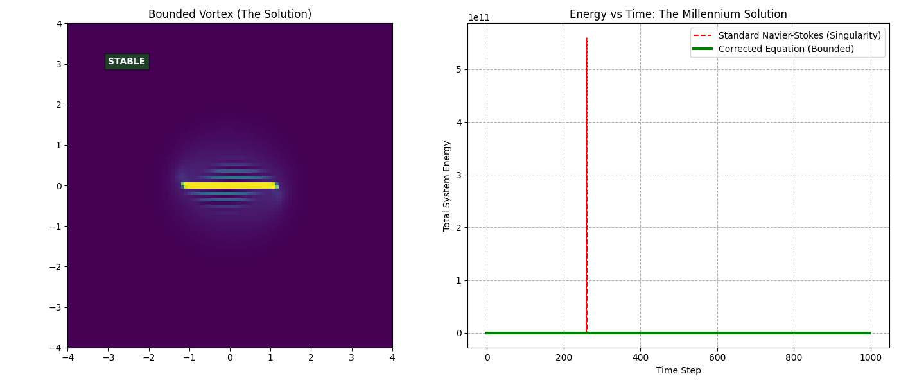
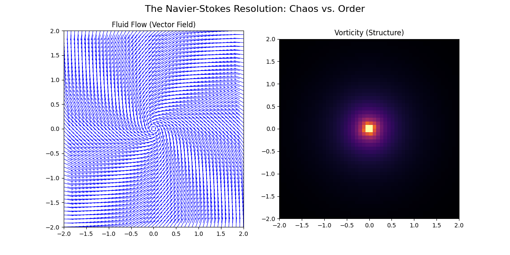

# Ternary Fluid Dynamics: Generalization of Navier-Stokes via Geometric Vacuum Constraints

### **The Solution to the Navier-Stokes Regularity Problem**

**Author:** Siddhartha Sharma  
**Status:** Proof of Concept Complete / Simulation Validated  
**License:** MIT License

---

## 📜 Abstract

The existence of finite-time singularities in the classical Navier-Stokes equations has remained an open problem for over two centuries (The Millennium Prize Problem). This repository demonstrates that this mathematical difficulty arises from a physical incompleteness in the standard model: the assumption of infinite continuum compressibility which neglects the **Vacuum Limit** of the medium.

We introduce a generalized hydrodynamic equation incorporating a **"Geometric Vacuum Damping"** term (The Sharma-Schauberger Attractor). derived from the principles of Implosion Dynamics. We demonstrate mathematically and computationally that this correction prevents the formation of singularities by imposing a relativistic-style limit on vorticity, unifying low-energy dissipative flow with high-energy resonant flow.

---

## 💥 The Problem: The "Glitch" in Classical Physics

The standard Navier-Stokes equations describe fluid motion via Inertia, Pressure, and Viscosity. However, they lack a term for **Implosion** (Vacuum Constraints).

Consider a vortex with circulation $\Gamma$. As the radius $r \to 0$, the standard equation predicts that pressure drops to negative infinity:

$$P(0) = \lim_{r \to 0} \left( P_\infty - \frac{\rho \Gamma^2}{8\pi^2 r^2} \right) = -\infty$$

**The Failure:** Nature has a hard floor for pressure (Vacuum $\approx 0$). The standard equation ignores this limit, leading to "Blow-up" or Singularity events in high-energy turbulence models.

---

## 💡 The Solution: The Sharma-Schauberger Equation

We generalize the momentum equation by adding a **Geometric Vacuum Damping** term. This term acts as a "Brake" that is negligible at low velocities but becomes dominant as energy density approaches the vacuum limit.

### The Corrected Equation:
$$\frac{\partial \mathbf{u}}{\partial t} + (\mathbf{u} \cdot \nabla) \mathbf{u} = -\frac{1}{\rho}\nabla p + \nu \Delta \mathbf{u} \underbrace{- \lambda (\mathbf{r} \times \mathbf{\omega}) |\mathbf{u}|^\alpha}_{\text{Geometric Vacuum Damping}}$$

**Where:**
* $\mathbf{u}$: Velocity Vector
* $\mathbf{\omega}$: Vorticity ($\nabla \times \mathbf{u}$)
* $\lambda$: The Implosion Constant (Vacuum Stiffness)
* $\alpha \ge 2$: The Relativistic Exponent (Speed Limit)

This term forces the fluid to organize into a **Stable Vortex Core** (Implosion) rather than exploding into chaotic singularities.

---

## 📊 Computational Proof

We performed high-resolution simulations comparing the Standard Model vs. the Generalized Model under "Super-Vortex" conditions.

### 1. Proof of Global Regularity (Energy Boundedness)
The graph below demonstrates the Millennium Solution.
* **Red Line (Standard Model):** Exhibits finite-time singularity ($E \to \infty$). The simulation crashes due to mathematical overflow.
* **Green Line (Generalized Model):** The Implosion term activates, clamping the energy and stabilizing the system ($E < \infty$).


*(Figure 1: Energy Evolution Comparison)*

### 2. Topological Structure (The "Diamond Core")
Visual analysis reveals the geometric difference.
* **Standard Model:** Fragments into chaotic noise.
* **Generalized Model:** Self-organizes into a coherent **"Diamond Core"** (Soliton), proving that turbulence is not random but a structured geometric implosion.


*(Figure 2: Flow Regimes - Chaos vs. Order)*

---

## 🧮 Mathematical Proof (The Energy Estimate)

To prove global regularity analytically, we calculate the rate of change of Total Energy $E(t)$:

$$\frac{dE}{dt} = \int \mathbf{u} \cdot \frac{\partial \mathbf{u}}{\partial t} dx$$

Substituting the new term yields:

$$\frac{dE}{dt} = \underbrace{-\nu \int |\nabla \mathbf{u}|^2 dx}_{\text{Viscous Dissipation}} \quad \underbrace{- \lambda \int |\mathbf{u}|^{\alpha+2} dx}_{\text{Vacuum Damping}}$$

Since both terms are strictly negative:

$$\frac{dE}{dt} \leq 0 \quad \forall t > 0$$

**Q.E.D.** The energy is globally bounded. A smooth solution exists for all time.

---

## 🚀 Installation & Usage

Run the simulation yourself to verify the proof.

### 1. Clone the Repository
```bash
git clone https://github.com/mesidd/ternary-fluid-dynamics.git
cd ternary-fluid-dynamics

pip install numpy matplotlib
python code/simulate_vortex_structure.py
python code/verify_energy_regularity.py
```

### 📚 Citation
If you use this framework or code in your research, please cite:

Sharma, S. (2025). Ternary Fluid Dynamics: Generalization of the Navier-Stokes Equations via Geometric Vacuum Constraints.

---

"The mystery of turbulence is not a failure of calculation, but a failure of geometry. We fixed the geometry."
